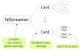

Python API Reference
====================

.. raw:: html

    

API is organized into the following logical groups:
    - :class:`~nistreamer.streamer.NIStreamer` represents the whole system.

    - Streamer contains a collection of **cards** each representing a physical device.
      There are separate classes for AO and DO (:class:`~nistreamer.card.AOCardProxy` and :class:`~nistreamer.card.DOCardProxy`)
      inheriting from :class:`~nistreamer.card.BaseCardProxy`.

    - Each device contains a collection of **channels** representing individual physical outputs.
      There are classes for AO and DO (:class:`~nistreamer.channel.AOChanProxy` and :class:`~nistreamer.channel.DOChanProxy`)
      inheriting from :class:`~nistreamer.channel.BaseChanProxy`.

There is also a separate class :class:`~nistreamer.streamer.NIStreamer.StreamHandle` for stream control
within ``with`` context.

.. raw:: html

   

.. autoclass:: nistreamer.streamer.NIStreamer
    :members:
    :undoc-members:
    :exclude-members: StreamHandle

.. raw:: html

   

.. autoclass:: nistreamer.streamer.NIStreamer.StreamHandle
    :members:
    :undoc-members:

Cards
-----

.. autoclass:: nistreamer.card.BaseCardProxy
    :members:
    :undoc-members:

.. raw:: html

   

.. autoclass:: nistreamer.card.AOCardProxy
    :members:
    :undoc-members:
    :show-inheritance:

.. raw:: html

   

.. autoclass:: nistreamer.card.DOCardProxy
    :members:
    :undoc-members:
    :show-inheritance:

Channels
--------

.. autoclass:: nistreamer.channel.BaseChanProxy
    :members:
    :undoc-members:

.. raw:: html

   

.. autoclass:: nistreamer.channel.AOChanProxy
    :members:
    :undoc-members:
    :show-inheritance:

.. raw:: html

   

.. autoclass:: nistreamer.channel.DOChanProxy
    :members:
    :undoc-members:
    :show-inheritance:
