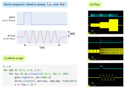

NI Pulse Streamer
=================

An abstraction layer providing a Python API for scripted pulse sequence generation with `National Instruments <http://www.ni.com/>`_ hardware.

         with a simple Python script. A single iteration of the sequence consists of a sine pulse
         on analog "drive" channel and a simultaneous "gate" pulse on a digital channel. The task
         is to perform a 2D parameter sweep - step over both amplitude and duration of the sine pulse.
         Step (1) - "Write code". A code snippet shows the whole script. It is only a few lines long
         and uses two nested loops to step over "amp" and "tau" parameters. For each value pair,
         it appends the sine drive and digital pulses to the sequence.
         Step (2) - "Play". A series of three oscilloscope screenshots shows consecutive zoom-in
         into the actual generated waveform from a several-second overview down to a singe
         drive-gate pulse pair demonstrating a full match with the expected waveform.
   :width: 100%
   :align: center

.. raw:: html

    

**Main features:**

* Simple Python API allows scripting very complex sequences.

* Streaming approach enables practically unlimited sequence duration. The pulse sequence is efficiently stored as a list of instructions, while the waveform samples are computed on the fly, requiring only a small amount of memory at any given time.

* The streaming back-end is implemented in Rust – fast, lightweight, and robust.

* Versatile package format – the streamer can be run as a standalone tool with a minimal Python script, or be integrated into any other control software.

See the `demo notebooks <https://github.com/pulse-streamer/ni-streamer/tree/main/py_api/demo>`_ for the example workflow.

.. toctree::
    :maxdepth: 2
    :caption: Contents:

    getting_started/index
    api/index
